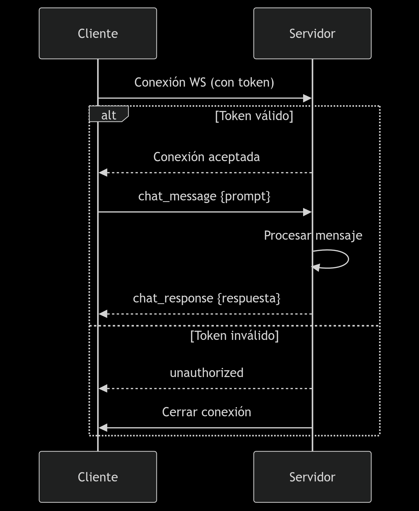

# WebSocket Chat API - Documentation

## 📌 Connection and Authentication

### Connection

```bash
ws://[dominio]
ws://localhost:8080
```

### Connections Requirements

- **Protocol**: WebSocket (`ws://` or `wss://` for secure connections)
- **Authentication**: JWT token in the query string

```javascript
const socket = new WebSocket('ws://localhost:8080?token=JWT_TOKEN')
```

## 🔐 Eventos del Sistema

### Connection (`connection`)

- **Descripción**: Automatic event on connect/disconnect
- **Errores**:

  - `unauthorized`: Issued when authentication fails

```json
{
  "success": false,
  "message": {
    "content": ["Error description"],
    "displayable": false
  },
  "data": null
}
```

- Possible error messages:
  - "Token not provided" (MISSING_TOKEN)
  - "Token is invalid" (INVALID_TOKEN)
  - "Authentication error" (other errors)

## 📨 Client Events

### `chat_message`

- **Purpose**: Send a message to the AI
- **Payload**:

```typescript
{
  userId: number;    // User ID
  prompt: string;    // Message to send
  sessionId?: number;// Session ID (optional)
}

```

- **Example**:

```javascript
socket.send(
  JSON.stringify({
    event: 'chat_message',
    data: {
      userId: 1,
      prompt: '¿Qué es React?',
      sessionId: 1,
    },
  }),
)
```

## 📩 Server Events

### `chat_response` (Success)

- **Structure**:

```typescript
{
  success: true,
  message: {
    content: string[],
    displayable: boolean
  },
  data: {
    sessionId: number; // Session ID
    content: string;   // Response content
  }
}
```

- **Example**:

```json
{
  "success": true,
  "message": {
    "content": ["Succesful response"],
    "displayable": false
  },
  "data": {
    "sessionId": 2,
    "content": "Este sistema funciona mediante..."
  }
}
```

### `chat_error` (Error)

- **Structure**:

```json
{
  "success": false,
  "message": {
    "content": ["Error description"],
    "displayable": true
  },
  "data": null
}
```

## 📋 Frontend Implementation Example

```javascript
class ChatWebSocket {
  constructor(url, token) {
    this.socket = new WebSocket(`${url}?token=${token}`)
    this.setupEventListeners()
  }

  setupEventListeners() {
    this.socket.onopen = () => console.log('Connection established')

    this.socket.onmessage = (event) => {
      const response = JSON.parse(event.data)

      if (response.event === 'chat_response') {
        console.log('Response:', response.data.content)
      } else if (response.event === 'chat_error') {
        console.error('Error:', response.message.content)
      } else if (response.event === 'unauthorized') {
        console.error('Auth error:', response.message.content)
        this.socket.close()
      }
    }

    this.socket.onclose = (event) => {
      console.log(`Connection closed: ${event.reason}`)
      if (!event.wasClean) {
        this.reconnect()
      }
    }
  }

  sendMessage(messageData) {
    if (this.socket.readyState === WebSocket.OPEN) {
      this.socket.send(
        JSON.stringify({
          event: 'chat_message',
          data: messageData,
        }),
      )
    } else {
      console.error('WebSocket is not open.')
    }
  }

  reconnect() {
    // Implementar lógica de reconexión
  }
}

// Uso
const chat = new ChatWebSocket('ws://localhost:3010', 'JWT_TOKEN')
chat.sendMessage({
  userId: 1,
  prompt: 'Hola, ¿cómo estás?',
})
```


